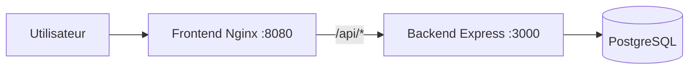

# VitalSync - Chaine CI/CD conteneurisee

## Description du projet

Ce projet a ete realise dans le cadre de l'epreuve E6.  
L'objectif est de mettre en place une chaine DevOps complete autour d'une application simple, et pas de developper une application metier complexe.

Le projet contient :
- un backend Node.js/Express (API REST),
- un frontend statique servi par Nginx,
- une base PostgreSQL,
- une orchestration Docker Compose,
- une pipeline CI/CD GitHub Actions,
- des manifestes Kubernetes (Deployment, Service, Ingress, Secret).

## Architecture

- `frontend` : sert `index.html` sur Nginx (port 80 dans le conteneur, expose en local sur 8080).
- `backend` : API Express sur le port 3000.
- `database` : PostgreSQL avec volume persistant.
- le frontend redirige `/api/*` vers le backend via `proxy_pass`.

### Schema simplifie (Mermaid)



## Prerequis (outils et versions)

- Git
- Docker Desktop (Docker Engine + Docker Compose v2)
- Node.js 20 (utile pour debug local hors Docker)

## Lancement en local avec Docker Compose

1. Cloner le depot :

```bash
git clone <URL_DU_REPO>
cd VitalSync
```

2. Creer le fichier `.env` depuis `.env.example` :

```bash
cp .env.example .env
```

3. Lancer les services :

```bash
docker compose up -d --build
```

4. Verifier les acces :
- Frontend : `http://localhost:8080`
- Backend health : `http://localhost:3000/health`

5. Arreter :

```bash
docker compose down
```

## Fonctionnement de la pipeline CI/CD

Fichier : `.github/workflows/ci-cd.yml`

Declencheurs :
- `push` sur `develop`
- `pull_request` vers `main`

Etapes :
1. **Lint and Tests**
   - installation des dependances backend,
   - execution ESLint,
   - execution des tests Jest.
2. **Build and Push Docker Images**
   - build backend + frontend,
   - tag des images avec le SHA du commit,
   - push sur GHCR.
3. **Deploy Staging and Health Check**
   - lancement temporaire avec Docker Compose,
   - verification de `/health`,
   - echec de la pipeline si le health check ne passe pas.

## Choix techniques et justifications

- **Express** : rapide a mettre en place pour une API REST simple.
- **Nginx** : tres adapte pour servir un frontend statique et faire un reverse proxy.
- **PostgreSQL officiel** : stable et standard pour une base relationnelle.
- **Docker multi-stage (backend)** : permet de tester pendant le build puis de produire une image finale plus legere.
- **Reseau bridge dedie (Compose)** : isole les services VitalSync du reste des conteneurs locaux.
- **Volume persistant Postgres** : evite la perte des donnees quand les conteneurs sont recrees.
- **Tag Docker par SHA** : version exacte et tracable, plus fiable que `latest`.
- **Liveness probe Kubernetes** : detecte les pods non sains et permet le self-healing automatique.

## Dossier Kubernetes

Les manifestes sont dans `k8s/` :
- `backend-deployment.yaml`
- `backend-service.yaml`
- `frontend-deployment.yaml`
- `frontend-service.yaml`
- `ingress.yaml`
- `secret-db.yaml`
